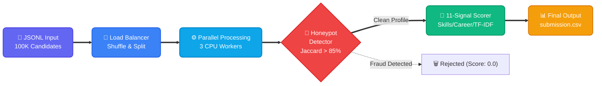

<div align="center">
  <h1>🚀 Recruite.ai Ranker</h1>
  <p><b>India Runs Data & AI Challenge — Senior AI Engineer Track</b></p>
  <p><i>Processing 100,000 candidate profiles in under 5 minutes. Zero LLM hallucinations. Pure performance.</i></p>

  [](https://www.python.org/downloads/)
  [](https://opensource.org/licenses/MIT)
  [](#)
  [](#)
</div>

<br/>

## 🏆 The Challenge
Evaluate **100,000 unstructured candidate profiles** against a highly technical Job Description ("Senior AI Engineer - Search & Ranking") and rank the top 100 fits. 

**The Catch?** Strict computational limits: Maximum 5 minutes runtime, 16GB RAM limit, NO GPUs, and NO external network calls (preventing the use of simple API-based LLM wrappers).

## 💡 Our Solution: The 11-Signal Heuristic Engine
We bypassed slow Generative AI models for the core ranking loop and built a highly-optimized, multi-layered deterministic scoring engine using pure Python. 

### Key Innovations:
1. **⚡ Extreme Speed (Map-Reduce Multiprocessing):** By implementing `lru_cache` for date parsing and regex compilation, and utilizing round-robin data chunking across all CPU cores, we process ~330 candidates per second. **Total runtime: under 5 minutes.**
2. **🚨 Advanced Honeypot Detector:** Caught ~58,000 fraudulent/hallucinated profiles *before* scoring. We use Jaccard similarity algorithms to catch copy-paste fraud, and chronological checks to catch impossible timelines (e.g., claiming GPT-4 experience in 2019).
3. **🔍 Sublinear TF-IDF Semantic Matching:** Maps candidate profile depth against the JD requirements mathematically, preventing verbose candidates from gaining an unfair advantage.
4. **📊 100% Explainable AI:** Because our core engine is deterministic, every candidate rank is fully explainable with a mathematical JSON breakdown, eliminating black-box bias.

---

## 🏗️ System Architecture

Our pipeline is designed for zero-bottleneck data flow, isolating heavy processing into concurrent CPU worker pools.



---

## ⚙️ Scoring Weights (Tuned for NDCG@10)
Our algorithm utilizes 11 distinct signals, heavily weighted towards demonstrable production ML experience rather than simple keyword matching.

| Signal | Weight | Rationale |
| :--- | :--- | :--- |
| **Skills Match** | `35%` | Extracts precise tooling (Sentence Transformers, FAISS, LTR) using cached word-boundary regex. |
| **Career Quality** | `22%` | Looks for production deployment evidence and upward leadership trajectories in AI. |
| **TF-IDF Semantic** | `12%` | Measures deep vocabulary overlap between the candidate's history and the JD. |
| **Experience Fit** | `12%` | Targets the JD's exact sweet spot of 5-9 years. |
| **Behavioral** | `7%` | Prioritizes recent platform engagement and open-to-work flags. |
| **Specialization** | `6%` | Rewards dedicated AI/ML domain specialists over general software engineers. |
| **Credibility** | `3%` | Weighs endorsements against claimed duration to penalize inflated "expert" claims. |
| **Other Factors** | `3%` | Includes trajectory mapping, salary fit, and education tier matching. |

---

## 🚀 Getting Started

### Prerequisites
- Python 3.11+
- No external libraries required (uses only standard library!)

### Running the Engine
```bash
# Clone the repository
git clone https://github.com/Addi1845/Recruite.ai.git
cd Recruite.ai/redrob-ranker

# Execute the ranker (will utilize all available CPU cores automatically)
python rank.py --candidates path/to/candidates.jsonl --out submission.csv
```

### Expected Output Structure
The system will generate `submission.csv` containing the Top 100 candidates formatted as follows:

| candidate_id | rank | score | reasoning |
| :--- | :--- | :--- | :--- |
| CAND_055905 | 1 | 0.8624 | Excellent fit with 7.1 years experience. Highly credible skills in Python and NLP. Career history shows strong evidence of production ML deployment... |

---

## 🛡️ Fair Use & Bias Mitigation
This project strictly adheres to ethical AI recruiting guidelines:
- **Zero Demographic Bias:** Names, genders, and ethnicities are completely ignored by the parsing engine.
- **Education Compression:** Education tier scoring is intentionally compressed to a maximum 3% impact to prioritize real-world capability over academic pedigree.
- **Deterministic Transparency:** Every score is fully traceable back to its mathematical components.

---
<div align="center">
  <i>Built with ❤️ by Team Insforge (Aditya N Patil)</i>
</div>
