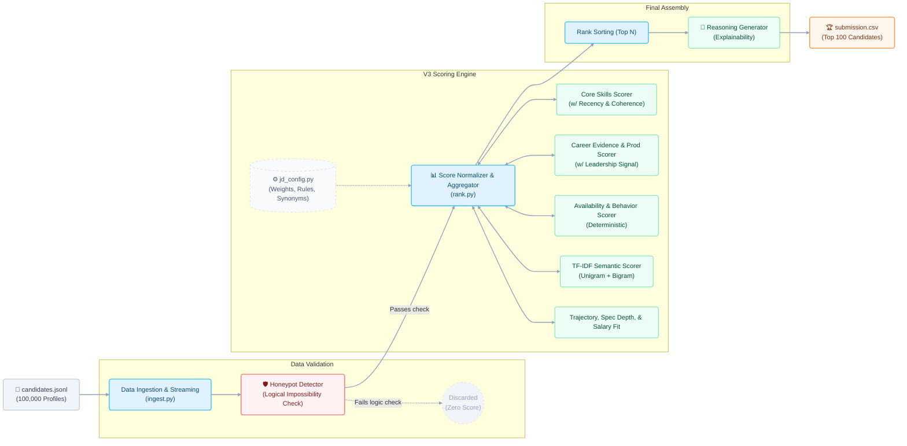

```mermaid
graph LR
    %% Subdued Professional Corporate Color Palette
    classDef inputData fill:#f1f5f9,stroke:#94a3b8,stroke-width:1px,color:#334155,rx:5px,ry:5px
    classDef coreEngine fill:#e0f2fe,stroke:#38bdf8,stroke-width:2px,color:#0c4a6e,rx:5px,ry:5px
    classDef config fill:#f8fafc,stroke:#cbd5e1,stroke-width:1px,stroke-dasharray: 5 5,color:#475569
    classDef scorer fill:#ecfdf5,stroke:#34d399,stroke-width:1px,color:#064e3b,rx:5px,ry:5px
    classDef trap fill:#fef2f2,stroke:#f87171,stroke-width:2px,color:#7f1d1d,rx:5px,ry:5px
    classDef dropped fill:#f1f5f9,stroke:#cbd5e1,stroke-width:1px,color:#94a3b8,stroke-dasharray: 5 5
    classDef outputData fill:#fff7ed,stroke:#fb923c,stroke-width:2px,color:#7c2d12,rx:5px,ry:5px

    %% 1. Input Stage
    Input["📄 candidates.jsonl<br/>(100,000 Profiles)"]:::inputData
    
    %% 2. Entry & Validation Gate
    subgraph Data Validation
        Stream["Data Ingestion & Streaming<br/>(ingest.py)"]:::coreEngine
        Honeypot["🛡️ Honeypot Detector<br/>(Logical Impossibility Check)"]:::trap
        Discard(("Discarded<br/>(Zero Score)")):::dropped
    end

    %% 3. The Scoring Engine (Stacked to keep it compact vertically but wide horizontally)
    subgraph V3 Scoring Engine
        Config[("⚙️ jd_config.py<br/>(Weights, Rules, Synonyms)")]:::config
        
        ScoreAgg["📊 Score Normalizer & Aggregator<br/>(rank.py)"]:::coreEngine
        
        %% Scorers
        S1["Core Skills Scorer<br/>(w/ Recency & Coherence)"]:::scorer
        S2["Career Evidence & Prod Scorer<br/>(w/ Leadership Signal)"]:::scorer
        S3["Availability & Behavior Scorer<br/>(Deterministic)"]:::scorer
        S4["TF-IDF Semantic Scorer<br/>(Unigram + Bigram)"]:::scorer
        S5["Trajectory, Spec Depth, & Salary Fit"]:::scorer
    end

    %% 4. Output Stage
    subgraph Final Assembly
        Sorter["Rank Sorting (Top N)"]:::coreEngine
        Reasoning["🤖 Reasoning Generator<br/>(Explainability)"]:::scorer
    end
    
    Output["🏆 submission.csv<br/>(Top 100 Candidates)"]:::outputData

    %% Routing
    Input ==> Stream
    Stream ==> Honeypot
    
    Honeypot -.-> |"Fails logic check"| Discard
    Honeypot ==> |"Passes check"| ScoreAgg

    %% Engine internal routing
    Config -.-> ScoreAgg
    ScoreAgg <--> S1
    ScoreAgg <--> S2
    ScoreAgg <--> S3
    ScoreAgg <--> S4
    ScoreAgg <--> S5

    %% Final path
    ScoreAgg ==> Sorter
    Sorter ==> Reasoning
    Reasoning ==> Output

    %% Formatting link styles to look clean
    linkStyle default stroke:#94a3b8,stroke-width:2px;
```
